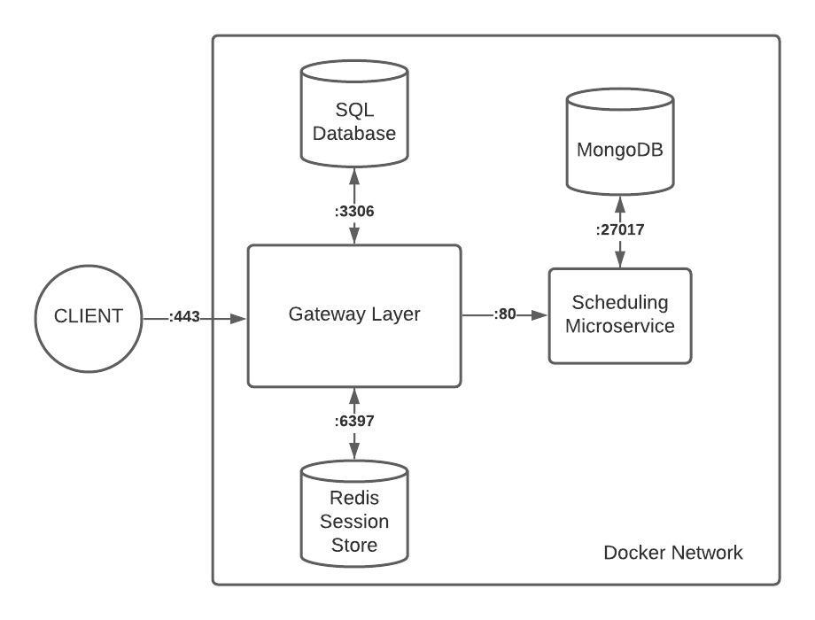

# Project Proposal
**Final Project for INFO 441**

**Team Members:** Kyler Sakumoto, Mackenzie Hutchison, Youssof Kowdan & Shruti Kompella

**Quick Links**: [Technical Description](#technical-description) | [User Stories](#user-stories) | [Endpoints](#endpoints)

## Project Description

### The Problem
Finding times to meet is difficult, even on small teams. Now more than ever, in the world of zoom university and work from home, students and professionals need services to help them navigate the labyrinth of classes, appointments and meetings. We want to target this audience of students in remote teams and professionals working in teams with a range of timezones.

Determining schedule overlap between team members via text or verbal communication is very tedious and error prone. It is difficult to keep a log each member schedule, furthermore manually identify commonalities across schedules. 

### Our Solution
We want to develop a platform for securely authenticated users to post a schedule which represents their availability for each day of the week. Users can create teams, and add other members with posted schedules to the teams. Users can be a part of multiple teams, and will be able to access the times where every member of each time is available, in order to easily schedule a time for a group meeting.

## Technical Description
### Architecture Diagram

### User Stories
| Story # | Priority  | User      | Description                                                                                                        |
|---------|-----------|-----------|--------------------------------------------------------------------------------------------------------------------|
| 1       | P0        | As a user | I want to create a user profile                                                                                    |
| 2       | P0        | As a user | I want to be able to post and store my availability                                                                |
| 3       | P0        | As a user | I want to be able to create teams                                                                                  |
| 4       | P0        | As a user | I want to be able to add members to my teams                                                                       |
| 5       | P1        | As a user | I want to be able to view teams I am part of                                                                       |
| 6       | P1        | As a user | I want to be able to view the other team members on a team (that I am also on)                                     |
| 7       | P1        | As a user | I want to be able to add days to my schedule after I have created a team                                           |
| 8       | P1        | As a user | I want to view the time ranges my teammates are available (adjusted to be their availabilities during my timezone) |

**Story 1:** After receiving a **POST** request to /users, the gateway will send a request to the nodejs server to create a new user account and store it in the **MySQL** database 

**Story 2:** After receiving a **POST** request to /v1/schedule, gateway will send a request to the nodejs server to post the availability for the given day to the given user schedule, and store it in **MongoDB**. This information will be stored as a converstion from the user's timezone to universal time zone.

**Story 3:** After receiving a **POST** request to v1/teams/, gateway will send a request to the nodejs server to create a team with a default schedule reflecting the creator's schedule and a set of members including only the creator and store it in **MongoDB** 

**Story 4:** After receiving a **POST** request to v1/teams/{teamID}/members, gateway will send a request to the nodejs server add a new member to the team with the asspciated team ID, and update the team schedule to reflect the newly added availability of the most recently added user. This will be stored in **MongoDB** 

**Story 5:** After receiving a **GET** request to v1/teams/, gateway gateway will send a request to the nodejs server to retrieve the teams the current user is a art of from **MongoDB**

**Story 6:** After receiving a **GET** request to v1/teams/{teamID}/members, gateway gateway will send a request to the nodejs server to retrieve the members for the team associated with the teamID **MongoDB**

**Story 7:** After receiving a **POST** request to /v1/schedule, gateway will send a request to the nodejs server to post the availability for the given day to the given user schedule, and store it in **MongoDB**. This information will be stored as a converstion from the user's timezone to universal time zone.

**Story 8:** After receiving a **GET** request to v1/teams/{teamID}, gateway gateway will send a request to the nodejs server to retrieve the overlapping availablilty for all users, retrieved from **MongoDB**

### Endpoints

#### Cheatsheet

Use this for quick reference! Each endpoint here will have its own handler.

| Endpoint | Methods | Notes |
| -------- | ------- | ----------- |
| [v1/schedules](#v1/schedules) | POST | Posts day availability for user to schedule |
| [v1/schedules](#v1/schedules) | GET | Gets availability for user |
| [v1/teams](#v1/teams) | POST | Create a new team |
| [v1/teams](#v1/teams) | GET | Gets all teams curren user is a part of |
| [v1/teams/{team_id}/members](#v1/teams{team_id}/members) | POST | Adds new user to team and updates full team availability |
| [v1/teams/{team_id}/members](#v1/teams{team_id}/members) | GET | gets members of the team |
| [v1/teams/{team_id}](#v1/teams{team_id}) | GET | Gets availability for the current team |
| [v1/users](#v1/users) | POST | Create new user |
| [v1/users/{user_id}](#v1/users/{user_id}) | GET, PATCH, POST, DELETE | Get user info / update info|
| [v1/sessions](#v1/sessions) | POST | Begin new session |
| [v1/sessions/mine](#v1/sessions/mine) | DELETE | End the current session

