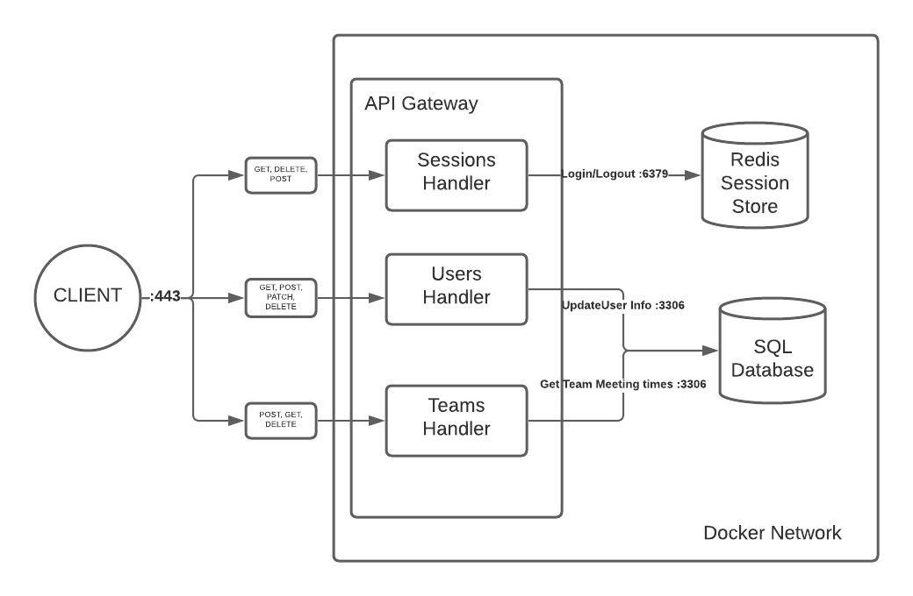

# Project Proposal
**Final Project for INFO 441**

**Team Members:** Kyler Sakumoto, Mackenzie Hutchison, Youssof Kowdan & Shruti Kompella

## Project Description

### The Problem
Finding times to meet is difficult, even on small teams. Now more than ever, in the world of zoom university and work from home, students and professionals need services to help them navigate the labyrinth of classes, appointments and meetings. We want to target this audience of students in remote teams and professionals working in teams with a range of timezones.

In particular, finding time for teams to meet is a big challenge. People have conflicting schedules and finding times that work for everyone can be a task, even with the existing market of scheduling apps. One of the most prevalent, for instance, When2meet is designed specifically to address this issue. However, the app lacks functionality that is crucial to actually planning meetings, like handling different time zones. The UI is also unintuitive, making it difficult to quickly see who is available when, or even just finding a time slot that is available for everyone. 

### Our Solution
We want to develop an app that will efficiently portray the current time for each member of the user’s team by the hour, so if the user would like to schedule a meeting or ping a member, they would know the current time of that member without having to look up their team members local time. The app will also list the availability of each member, and show available times for everyone to meet.

As developers, we felt like a scheduling application that was easy and quick to use that also addressed teams with multiple time zones didn’t exist. That’s why we wanted to work on developing a solution that addressed all these issues and we felt like it would be interesting to work on from a technical standpoint.

## Technical Description
### Architecture Diagram

### User Stories
| Story # | Priority  | User      | Description                                                                                                        |
|---------|-----------|-----------|--------------------------------------------------------------------------------------------------------------------|
| 1       | P0        | As a user | I want to create a user profile                                                                                    |
| 2       | P0        | As a user | I want to be able to create teams                                                                                  |
| 3       | P0        | As a user | I want to be able to view teams I am part of                                                                       |
| 4       | P0        | As a user | I want to be able to view the other team members on a team (that I am also on)                                     |
| 5       | P0        | As a user | I want to be able to view the timezones of other team members                                                      |
| 6       | P1        | As a user | I want to set and update the time ranges that I am available for during a week, my timezone, and my password       |
| 7       | P1        | As a user | I want to view the time ranges my teammates are available (adjusted to be their availabilities during my timezone) |
| 8       | P0        | As a user | I want to view my user information                                                                                 |
| 9       | P0        | As a user | I want to be able to remove myself from a given team                                                               |
| 10      | P0        | As a user | I want to be able to join a given team                                                                             |

**Story 1:** After receiving a **POST** request to /users, the gateway will create a new user account and store it in the **MySQL** database \
**Story 2:** After receiving a **POST** request to /teams, gateway will create a new team and store it in **MySQL** database and update user table to include teamID \
**Story 3:** After receiving a **GET** request to /teams/{team_id}, gateway will retrieve users on the team with teamid in url and display on webpage. \
**Story 4:** After receiving a **GET** request to /teams/{teamid}, gateway will retrieve team and associated user information from the **MySQL database \
**Story 5:** After receiving a **GET** request to /teams/{teamid}, gateway will retrieve the timezones of each member in team (with info in story 4) \
**Story 6:** After receiving a **GET** request to /timezone/{user_id}, gateway will retrieve the timezone of the user with user_id in url. Then when they set or update availability, a POST or PATCH request is sent to /timezone/{user_id} and the gateway will store this information in the MySQL database. \
**Story 7:** After receiving **GET** request to /users/me or /users/{user_id}, gateway will display the timezone and availability of the authenticated user \
**Story 8:** After receiving **GET** request to /users/me or /users/{user_id}, gateway will display user profile information (including info in story 7) \
**Story 9:** After receiving a **DELETE** request to /users/me with the parameter ?team=id, gateway will remove you from the team with given teamid \
**Story 10:** After receiving a **POST** request to /users/me with the parameter ?team=id, gateway will add you to the team with given teamid

### Endpoints
#### /teams
```POST /teams:``` creates a new team

  * Request Header

    * ```Authorization:``` bearer token with session ID
    * ```Content-Type:``` application/json

  * Request Body
    ```json
    {
        "teamName": "Team Name",
        "ownerID": 1,
        "memberIDs": [1, 2, 3, 4]
    }
    ```
    **Condition:** ownerID must match ID of the current session user
  
  * Response Status
    | Code | Description |
    | ---- | ----------- |
    | 201 | Successfully created team |
    | 400 | Content not JSON / badly formatted
    | 401 | Must be logged in to create team |
    | 403 | Cannot create team for another user |
    | 405 | Method must be `POST` |
    | 500 | Internal error creating team |

  * Response Body
    ```json
    {
        "teamID": 1,
        "teamName": "Team Name"
    }
    ```

#### /teams/{team_id}
```GET /teams/{team_id}:``` returns the users associated with the requested team

  * Request Header

    * ```Authorization:``` bearer token with session ID

      **Condition**: current user must be member of requested team
  
  * Response Status

    | Code | Description |
    | ---- | ----------- |
    | 200 | Successfully returned team |
    | 401 | Unauthorized, must be logged in |
    | 403 | User must be member of team |
    | 405 | Method must be `GET` or `DELETE` |
    | 500 | Internal error retrieving team |

  * Response Body
    ```json
    [
      {
          "teamID": 1,
          "teamName": "Team Name",
          "teamAvailability": [],
          "users": [{users}]
      },
    ]
    ```
    
#### /users
```POST /users:``` creates a new user
  * Request Header
    
    * ```Content-Type:``` application/json

  * Request Body
    ```json
    {
        "userName": "User1",
        "password": "password",
        "passwordConf": "password",
        "firstName": "John",
        "lastName": "Cena"
    }
    ```
  
  * Response Header

    * ```Authorization:``` bearer token with session ID for new user

  * Response Status

    | Code | Description |
    | ---- | ----------- |
    | 201 | Successfully created user |
    | 400 | Content not JSON / badly formatted |
    | 405 | Method must be `POST` |
    | 500 | Internal error creating team |

  * Response Body
    ```json
    {
        "userID": 1,
        "userName": "User1"
    }
    ```

#### /users/{user_id}

```All requests:```
  * Request Header

    * ```Authorization:``` bearer token with session ID

  ```GET /users/{user_id} /users/me:``` returns the profile of the requested user

  * Response Status

    | Code | Description |
    | ---- | ----------- |
    | 200 | Successfully returned user |
    | 403 | Unauthorized, must be logged in |
    | 404 | No user found for given ID |
    | 405 | Method type not allowed |
    | 500 | Internal error retrieving user |

  * Response Body
    ```json
      {
          "userName": "User1",
          "timeZone": "PST",
          "availability": [],
          "firstName": "John",
          "lastName": "Cena"
      }
      ```

```PATCH /users/me:``` updates the currently signed in user
  * Request Header

    * ```Content-Type:``` application/json

  * Request Body
    ```json
      {
        "newPassword": "password",
        "newPasswordConf": "password",
        "timezone": "PST",
        "availability": []
      }
    ```
  
  * Response Status
    | Code | Description |
    | ---- | ----------- |
    | 200 | Successfully returned user |
    | 400 | Content not JSON / badly formatted |
    | 403 | Unauthorized, not the current user |
    | 405 | Method type not allowed |
    | 500 | Internal error updating user |

```POST /users/me:``` adds current user to a team
  * Parameters
    * ```?team=id``` the team to join

  * Response Status
    | Code | Description |
    | ---- | ----------- |
    | 200 | Successfully joined team |
    | 403 | Unauthorized, must be logged in |
    | 404 | No team found for given ID |
    | 405 | Method type not allowed |
    | 500 | Internal error joining team |

```DELETE /users/me:``` removes the current user from requested team
  * Parameters
    * ```?team=id``` the team to leave

  * Response Status
    | Code | Description |
    | ---- | ----------- |
    | 204 | Successfully left team |
    | 403 | Unauthorized, must be logged in |
    | 404 | No team found for given ID |
    | 405 | Method type not allowed |
    | 500 | Internal error leaving team |

#### /sessions
  ```POST /sessions:``` begins a new session for the given user

#### /sessions/mine
 ```DELETE /sessions/mine:``` ends the current session
